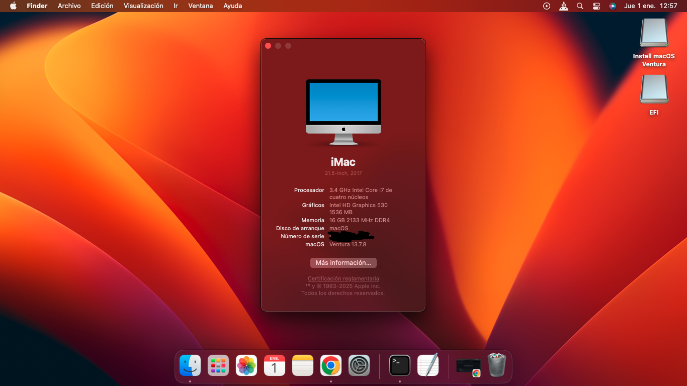

# Hackintosh Intel i7-6700 (Skylake) - macOS Ventura 

Successfull Hackintosh build running **macOS Ventura** on Intel Skylake hardware. This configuration provides full Graphics Acceleration, native Power Management, and stability using the latest OpenCore version.

## 🖥 Hardware Specifications

| Component | Model | Notes |
| :--- | :--- | :--- |
| **CPU** | Intel Core i7-6700 | Skylake, 4C/8T, 3.4 GHz |
| **Motherboard** | Coolmark H110 | Intel H110 Chipset |
| **iGPU** | Intel HD Graphics 530 | Spoofed as Kaby Lake (Intel HD 630) for Ventura support |
| **dGPU** | None | Using integrated graphics only |
| **RAM** | 16 GB DDR4 | Kingston 2133 MHz |
| **Storage** | Lexar NQ100 SSD | 960 GB SATA |
| **SMBIOS** | `iMac18,1` | Best match for Skylake CPU on Ventura |

## ⚙️ Software & Bootloader

* **OpenCore Version:** 1.0.6 (Latest Release)
* **Kexts:** All kexts updated to their latest versions as of Jan 2026.
* **macOS Version:** Ventura 13.7.8

## ✅ What Works
* **Graphics Acceleration (Metal):** Full acceleration for Intel HD 530 (1536 MB VRAM).
* **Power Management:** Native CPU Power Management (SpeedStep/Turbo Boost) working via `CPUFriend`.
* **Audio:** Working (Layout ID: 5).
* **Ethernet:** Realtek RTL8111 working.
* **App Store & Updates:** Working (using `revpatch=sbvmm`).

## ⚠️ Important Post-Install Steps

### 1. Generate your own SMBIOS (Mandatory)
For security reasons, the `config.plist` provided in this repository has blank or generic serial numbers. You **MUST** generate your own to use iCloud services safely.
* Download [GenSMBIOS](https://github.com/corpnewt/GenSMBIOS).
* Select `iMac18,1` as the model.
* Replace the following values in `PlatformInfo -> Generic` within your `config.plist`:
    * `MLB`
    * `SystemSerialNumber`
    * `SystemUUID`

### 2. Map Your USB Ports
The included `USBToolBox.kext` is a powerful tool, but USB ports vary wildly between motherboard revisions (especially generic H110 boards).
* **Recommendation:** Do not rely solely on the provided USB map.
* Use [USBToolBox](https://github.com/USBToolBox/tool) on Windows (or macOS) to create a custom `UTBMap.kext` specific to your motherboard layout.
* Replace my `UTBMap.kext` with yours to ensure sleep/wake works perfectly.

### 3. YouTube & Video Playback
Since the Intel HD 530 lacks hardware decoding for **VP9** and **AV1** codecs (used by YouTube for 4K), high-resolution video might stutter or consume high CPU.
* **Solution:** Install the [enhanced-h264ify](https://github.com/alextrv/enhanced-h264ify) extension in your browser (Chrome/Edge/Firefox).
* This forces YouTube to use **H.264**, which is fully supported by the hardware, ensuring smooth playback and low CPU usage.

## 🛠 BIOS Settings
* **Secure Boot:** Disabled
* **VT-d:** Disabled (or use `DisableIoMapper` quirk)
* **CFG Lock:** Disabled (or use `AppleXcpmCfgLock` quirk)
* **SATA Mode:** AHCI
* **Serial Port:** Disabled (Optional, but recommended to avoid conflicts)

## 👏 Credits
* [Acidanthera](https://github.com/acidanthera) for OpenCore and Kexts.
* [Dortania](https://dortania.github.io/) for the extensive guides.
